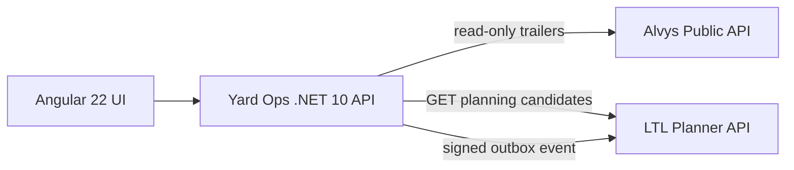

# Architecture



## Boundary

Yard Ops owns physical yard state, gate/dock actions, and inspection readiness. It knows only LTL Planner's published integration contract (`/api/integrations/v1/`) and a shared HMAC signing key; it does not reference LTL implementation classes or share its storage.

## Integration style

Yard -> LTL demonstrates two patterns deliberately:

- synchronous HTTP for a human waiting on candidate data (`GET /api/ltl/candidates/{trailerNumber}`, which calls LTL's `yard/candidates`);
- asynchronous signed event delivery for state changes. Gate moves and passed inspections enqueue an integration event in a local outbox; a background dispatcher signs the exact JSON body with HMAC-SHA256 (`X-Portfolio-Signature`) and POSTs it to LTL's `yard/events`. Events carry `schemaVersion: 1` and a stable `eventId`, so LTL can ingest them idempotently.

The outbox is in-memory in this portfolio build to keep the demo self-contained. In production the same store boundary could be backed by SQL and drained by one or more workers.

## Failure behavior

- Yard actions commit locally first; they never wait on LTL.
- Candidate lookup reports LTL unavailability explicitly with `503` and leaves yard state unchanged.
- Undelivered events stay pending and retry with bounded exponential backoff.
- External Alvys calls have bounded timeouts/resilience and surface degraded state instead of fabricating data.
- With no LTL Planner configured, Yard runs standalone: yard workflows are unaffected and LTL features report unavailable.

## Cloudflare topology

```text
        Cloudflare edge
              |
   <APP_HOST> or yard-ops.<account>.workers.dev
              |
     Worker + Angular assets
              |  /api/*, /health
              v
     Yard .NET 10 Container  ----->  LTL_BASE_URL (ltl-planner deployment)
```

The LTL base URL is configured at deployment time (`LTL_BASE_URL` repository variable). The HMAC signing key is stored as a Worker secret in both deployments and must match.
