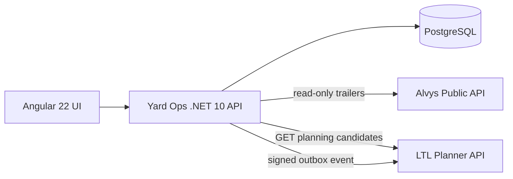

# Architecture



## Boundary

Yard Ops owns physical yard state, gate/dock actions, and inspection readiness. It knows only LTL Planner's published integration contract (`/api/integrations/v1/`) and a shared HMAC signing key; it does not reference LTL implementation classes or share its storage.

## Data model

Spots (parking and dock doors), trailers, gate events, moves, inspections and the outbox, in one EF Core context (`api/Data`). Migrations target PostgreSQL and are applied by the deploy pipeline (`dotnet Portfolio.*.Api.dll migrate`, run as the schema owner over a direct connection) before the new container starts; the running app connects through the pooler as a role that can only read and write rows, and reports not-ready if the schema is behind its build. Local runs and Compose still migrate on startup (`Database:MigrateOnStartup`); without `DATABASE_URL` the API creates a throwaway SQLite database from the same model. A unique index on the trailer's spot means two trailers can never occupy one spot.

## Trailer lifecycle

`Services/TrailerRules.cs` holds the whole state machine as one table: Expected → Arrived (gate in) → AtDoor (moved to a door) → Loading → Ready (inspection passed) → Departed (gate out). Arrived, AtDoor and Loading trailers can be put on hold, and a failed inspection holds them too; releasing returns the trailer to Arrived or AtDoor depending on where it is parked. Every action is checked against the table, and a refused action returns 409 listing what the trailer can do next.

## Integration style

Yard -> LTL demonstrates two patterns deliberately:

- synchronous HTTP for a human waiting on candidate data (`GET /api/ltl/candidates/{trailerNumber}`, which calls LTL's `yard/candidates`);
- asynchronous signed event delivery for state changes. Gate moves and passed inspections enqueue an integration event in a local outbox; a background dispatcher signs `{unix timestamp}.{exact JSON body}` with HMAC-SHA256 (`X-Portfolio-Timestamp`, `X-Portfolio-Signature`) at send time and POSTs it to LTL's `yard/events`; LTL rejects timestamps more than five minutes off, so a captured request cannot be replayed later. Events carry `schemaVersion: 1` and a stable `eventId`, so LTL can ingest them idempotently.

The outbox is a table written in the same transaction as the yard change, so an event exists if and only if its change committed. A background dispatcher drains it every few seconds and immediately after each change; the API runs as a single instance, so one pass at a time is enough (several instances would claim rows with `FOR UPDATE SKIP LOCKED`). The container sleeps after 10 minutes without traffic, so an hourly Cloudflare cron calls `POST /api/outbox/drain` to deliver anything that was waiting on LTL. During weekday business hours a second cron pings `/health/ready` every five minutes, which keeps both the container and the Neon compute warm.

## Failure behavior

- Yard actions commit locally first; they never wait on LTL.
- Candidate lookup reports LTL unavailability explicitly with `503` and leaves yard state unchanged.
- Undelivered events stay pending and retry with bounded exponential backoff.
- External Alvys calls have bounded timeouts/resilience and surface degraded state instead of fabricating data.
- With no LTL Planner configured, Yard runs standalone: yard workflows are unaffected and LTL features report unavailable.

## Cloudflare topology

```text
        Cloudflare edge
              |
   <APP_HOST> or yard-ops.<account>.workers.dev
              |
     Worker + Angular assets
              |  /api/*, /health
              v
     Yard .NET 10 Container  ----->  LTL_BASE_URL (ltl-planner deployment)
```

The LTL base URL is configured at deployment time (`LTL_BASE_URL` repository variable). The HMAC signing key is stored as a Worker secret in both deployments and must match.
